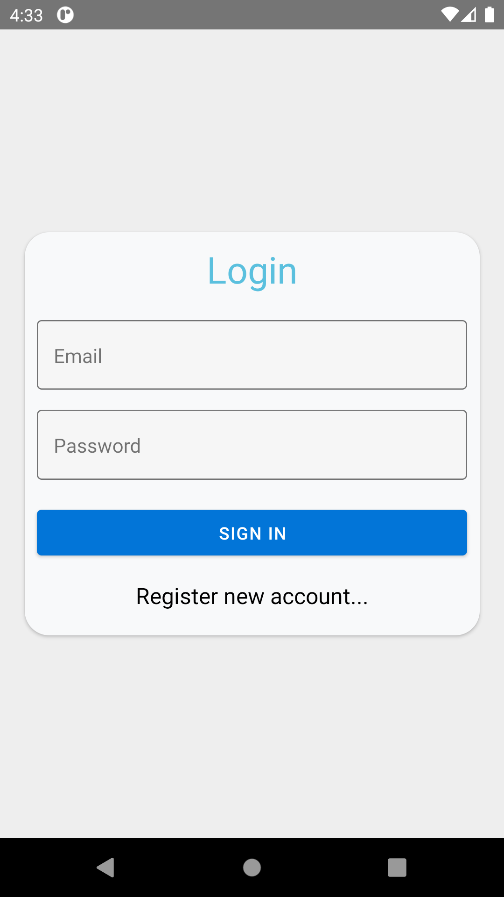
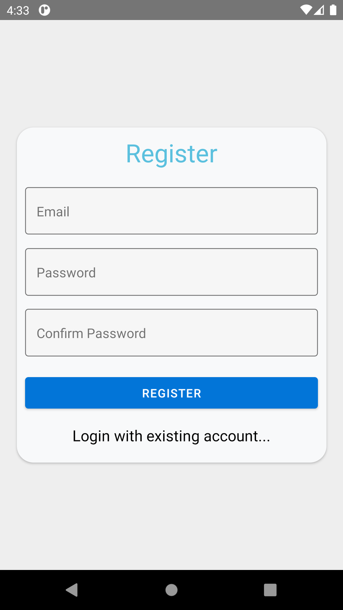
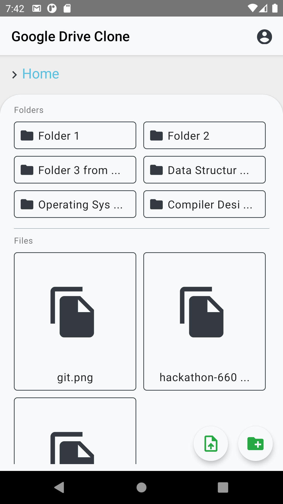
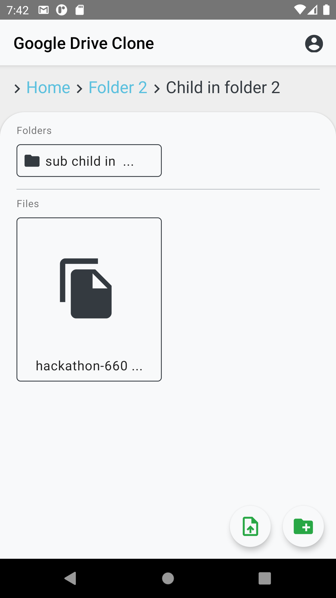
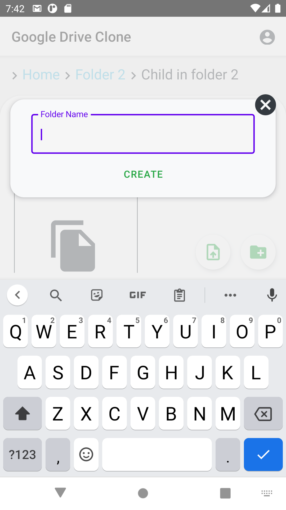
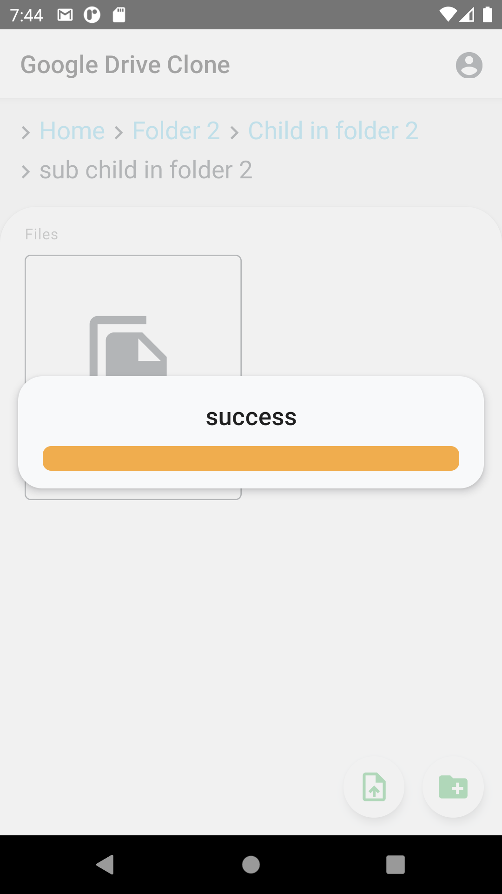
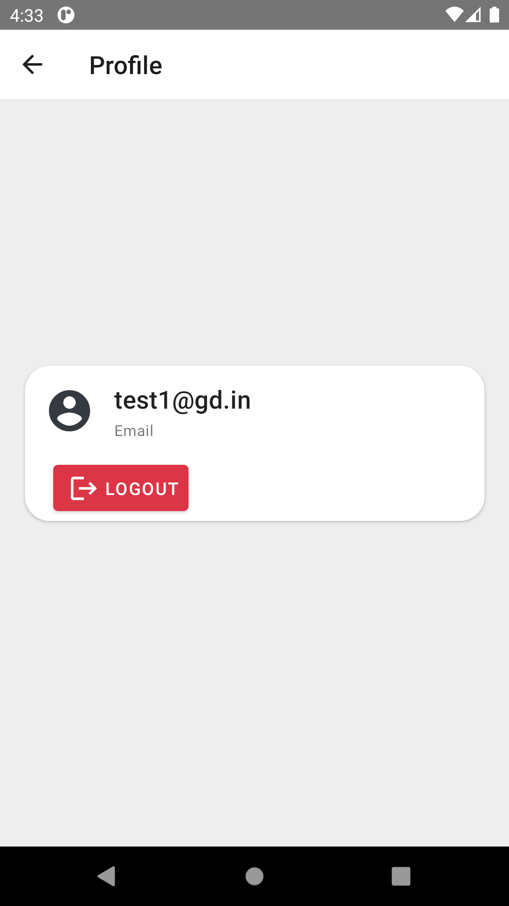

# Google Drive Clone

### Technologies

`React Native` `Firebase`

[Similar Web App](https://github.com/A7abhilash/google-drive-clone)

### Screenshots

<h6>
#1 Login Screen | #2 Register Screen | #3 Home(Root folder) | #4 Home(Sub folders) | #5 Add new folder modal | #6 Status of uploading file | #7 Profile Screen
</h6>

